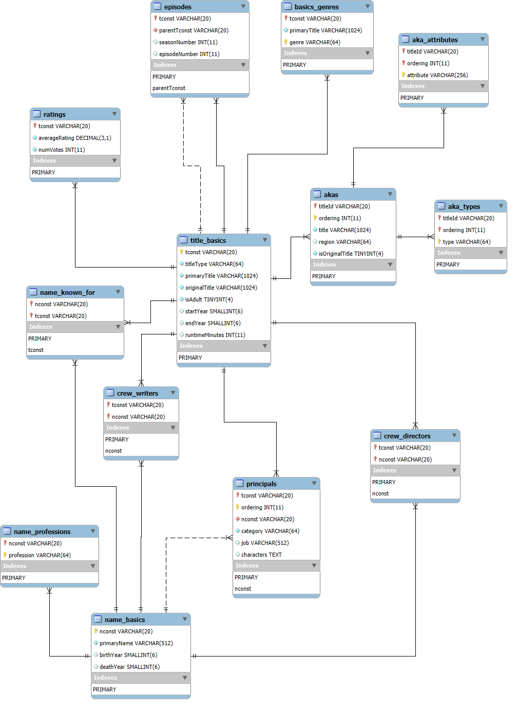

# Proyecto 1
Diego René Chen Teyul 202202882
Angel Eduardo Tubac Simón 202200309
Néstor Enrique Villatoro Avendaño 202200252

## Base de datos 


# Carga masiva de los datos 
Para la carga masiva de los datos utilizamos los archivos tsv que fueron proporcionados para el proyecto, esta carga  masiva la hicimos utilizando un script en python para que fuera mas fácil, las ventajas de este script son:  
* Un mejor rendimiento para la carga masiva debido a que manejamos lotes con buffers de datos. 
* También manejamos excep´ciones con rollback por si algo sucede a mitad de la carga. 
* Gracias al INSERT IGNORE podemos re ejecutar la carga sin tener problemas con claves repetidas, esto también ayuda a la eficiencia de la carga si en caso existieran problemas. 
* Normalización de datos vacíos a NULL para que sean más fáciles de manejar y con el tema de tipajes nos ayuda a convertir tanto enteros como decimales y fechas de forma en que sea mas seguro saber su tipaje dentro de la base de datos.
* Manejamos grandes cantidades de datos ajustando el limite de CSV al principio del script.
* Gracias a que ya tenemos las dependencias por la normalización previa podemos hacer una carga que respete las jerarquías dentro de la tabla y que la carga sea coherente. 
* Nos aseguraamos que se parametricen los %s para evitar problemas al insertar los datos brutos.

Utilizamos este script debido a que el enfoque por lotes tiene una magnitud mas grande y usa menor RAM al igual que LOAD DATA INFILE suele ser lo más veloz y además podíamos introducir validaciones antes de meter los datos a la tabla.

# Cómo se hizo el backup de la base de datos MySQL del proyecto en un contenedor Docker

## 1. Conectar al contenedor Docker

Primero, nos conectamos al contenedor Docker donde se está ejecutando MySQL:

```bash
docker exec -it mysql-docker_bases2 bash
```

Esto te dará acceso a la terminal dentro del contenedor Docker.

## 2. Realizar el backup usando `mysqldump`

Una vez dentro del contenedor, se ejecuta el siguiente comando `mysqldump` para realizar un **backup de la base de datos**. Este comando exportará la base de datos a un archivo SQL dentro del contenedor:

```bash
mysqldump -u root -p BASES2_PROYECTOS > /tmp/bases2_backup.sql
```

- Ingresamos la contraseña del MySQL(en este caso `bases2_proyecto`).
- El archivo de backup se guardará en el directorio `/tmp` dentro del contenedor.

## 3. Verificar que el archivo de backup se haya creado

Para verificar que el archivo de backup se creó correctamente, usamos `/tmp`:

```bash
ls /tmp/bases2_backup.sql
```

Al ver el archivo `bases2_backup.sql`, significa que el backup se creó correctamente.

## 4. Copiar el archivo de backup fuera del contenedor

Para copiar el archivo de backup desde el contenedor a la pc local, se ejecuta el siguiente comando **fuera del contenedor**:

```bash
docker cp mysql-docker_bases2:/tmp/bases2_backup.sql C:\Users\hp\Desktop\bases2_backup.sql
```

- Este comando copiará el archivo `bases2_backup.sql` del contenedor al **escritorio** en Windows.

## 5. Verificar que el archivo de backup se haya copiado correctamente

Vamos a la ubicación donde especificaste que se copiara el archivo (en este caso, el escritorio de Windows). Deberías encontrar el archivo `bases2_backup.sql`.